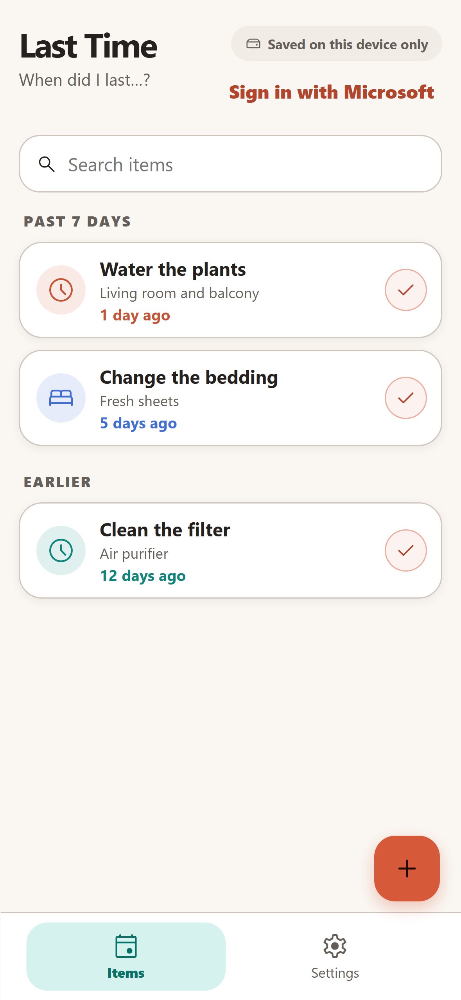
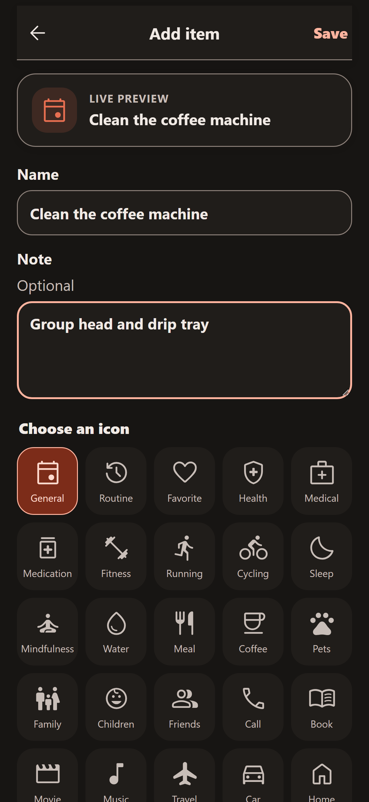
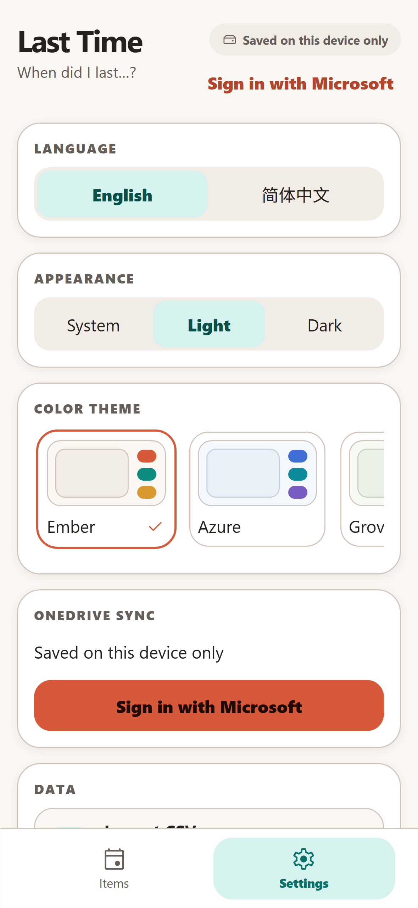
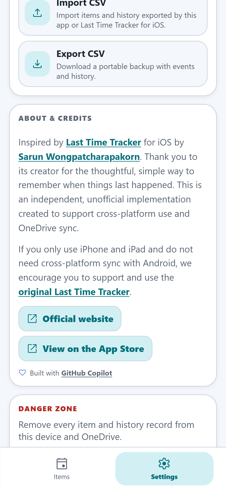

English | [简体中文](README.zh-CN.md)

<p align="center">
  
</p>

<p align="center">
  <a href="https://lasttime.feliciameow.com/"></a>
  
  <a href="LICENSE"></a>
</p>

Last Time is an offline-first, installable PWA for remembering when something last happened—without turning everyday life into a task list. Your history works locally, and optional OneDrive App Folder sync keeps your devices aligned.

<p align="center"><strong><a href="https://lasttime.feliciameow.com/">Open Last Time</a></strong></p>

## Why Last Time?

- **History, not pressure.** See when you watered the plants, changed bedding, or cleaned a filter without deadlines, streaks, or overdue badges.
- **Fast, private, and offline-first.** Events and occurrence history live in IndexedDB and remain usable without a connection.
- **Portable by design.** Import legacy iOS CSV files, export enriched CSV, and optionally sync through your private OneDrive App Folder.
- **Made for every screen.** Install from Safari, Chrome, or Edge; use English or Simplified Chinese; choose from five clean light/dark palettes.

## Product walkthrough

<table>
  <tr>
    <td width="50%" align="center">
      <br />
      <sub><strong>At-a-glance history.</strong> Calendar-day-aware elapsed time and recent occurrence context.</sub>
    </td>
    <td width="50%" align="center">
      <br />
      <sub><strong>Expressive editing.</strong> Live icon and color preview with a broad, stable catalogue.</sub>
    </td>
  </tr>
  <tr>
    <td width="50%" align="center">
      <br />
      <sub><strong>Clear control.</strong> Appearance, language, and honest device-only or OneDrive sync state.</sub>
    </td>
    <td width="50%" align="center">
      <br />
      <sub><strong>Transparent by default.</strong> Credits, privacy boundaries, data tools, and open-source licensing.</sub>
    </td>
  </tr>
</table>

## Use the app

Open the live PWA at **[https://lasttime.feliciameow.com/](https://lasttime.feliciameow.com/)**.

### Install on iPhone or iPad

1. Open the exact live URL in Safari.
2. Tap **Share**, then **Add to Home Screen**.
3. Launch Last Time from the installed Home Screen icon.
4. When the app shows **New version available**, choose **Update now**.

On first use, install metadata follows the browser's primary language. After you choose a language in Last Time, that effective app language drives the localized page title and install manifest on the current and future loads. Existing Home Screen icons may wait for the browser's installed-manifest refresh; remove and add the icon again to verify a name change immediately.

The version currently running on the device is shown under **Settings → About & credits**.

### Install on Android

1. Open the live URL in Chrome or Edge.
2. Choose **Add to Home screen** (preferred) or **Install app**.
3. Launch Last Time from the installed app icon.

#### Xiaomi, MIUI, and HyperOS

If Microsoft Edge opens **App info** instead of adding Last Time, grant Edge permission to create Home screen shortcuts. The exact path varies by MIUI/HyperOS version, but it is usually:

**Settings → Apps → Manage apps → Microsoft Edge → Permissions / Other permissions → Home screen shortcuts**

Enable **Home screen shortcuts** in the Chinese system settings, return to Edge, and choose **Add to Home screen** again. This permission—not the broader **Install unknown apps** permission—was the verified fix. The App info redirect is Android/HyperOS or browser behavior; Last Time does not redirect users there.

If HyperOS asks for broad unknown-app installation access, prefer trying Chrome instead. If you deliberately enable that access for installation, use it only for this trusted PWA and disable it afterward. Some Xiaomi builds create only a Home screen shortcut rather than listing the PWA as a separately installed app; the shortcut still launches the standalone web experience.

Chrome and Edge 148 and newer can read localized manifest members directly. For Android browsers that do not yet support them, the page selects a locale-specific manifest whose top-level name is already localized. Both manifests share the same application ID.

### Optional cross-device sync

Data stays in this device's IndexedDB while signed out. To synchronize devices, sign in with the same personal or organizational Microsoft account on each device. The app uses only the account's private OneDrive App Folder and the delegated `Files.ReadWrite.AppFolder` permission; it does not request access to the rest of OneDrive. An organizational tenant may require administrator consent.

Sync runs while the app is open: at startup, foreground resume, local changes/imports, manual retry, and network restoration. Reliable closed-app/background sync is not claimed or required.

### Migrate from Last Time Tracker for iOS

Export a CSV from [Last Time Tracker for iOS](https://apps.apple.com/app/id534982023), then open **Settings → Data → Import CSV** in this app. In the original legacy format, `Event` identifies the item and a generic `Note` on a row with `Timestamp` or `Date`/`Time` is treated as that individual history record's note.

Since version 1.0.1, the app derives privacy-safe opaque IDs for legacy rows that do not contain IDs. Event identity uses the NFKC-normalized, trimmed, whitespace-collapsed, lowercase event name; occurrence identity uses that event ID plus the exact normalized ISO timestamp. Importing the same source repeatedly or independently on multiple devices therefore converges without semantic name-based deduplication during normal sync.

If an older build already created duplicates, do not try to repair them with heuristic name matching:

1. Close Last Time on every other device.
2. Update one device to the latest version, sign in, and go online.
3. Open **Settings → Data → Clear all data**, complete both confirmations, and wait for the OneDrive deletion sync to succeed.
4. Import the corrected enriched CSV once on that device and sync again.
5. Reopen the other devices only after that sync completes; let them sync without importing the CSV again.

This permanently removes existing item/history data but keeps settings and Microsoft sign-in. The app is local-first, has no application backend, and includes no analytics. OneDrive sync is optional.

## Run locally

Requires Node.js 22. The pinned version is recorded in `.nvmrc`.

```powershell
npm ci
npx playwright install chromium
npm run dev
```

Production checks:

```powershell
npm run lint
npm run typecheck
npm test
npx playwright test
npm run build
npm run lighthouse
```

`npm run lighthouse` runs three mobile-profile audits against the local production build. Scores are report-only; dedicated application and PWA tests remain authoritative.

## OneDrive setup

No client secret is used or needed. Create a **Single-page application** registration in Microsoft Entra admin center:

1. Register an app with **Accounts in any organizational directory and personal Microsoft accounts** as the supported account type (`AzureADandPersonalMicrosoftAccount`).
2. Under **Authentication**, add a **Single-page application** redirect URI matching the exact deployed app URL, including its trailing slash:
   - Local Vite: `http://localhost:5173/`
   - Production: `https://lasttime.feliciameow.com/`
   - Cloudflare rollback: the root `https://lasttimeweb.<account-subdomain>.workers.dev/` URL shown after deployment, including the trailing slash
3. Under **API permissions**, add Microsoft Graph delegated permission `Files.ReadWrite.AppFolder`. Admin consent is normally not required for personal use.
4. Copy the Application (client) ID into `.env.local`:

```text
VITE_MS_CLIENT_ID=00000000-0000-0000-0000-000000000000
```

The app pins MSAL Browser to `https://login.microsoftonline.com/common`, matching the organizational-and-personal account audience. It requests only the delegated `Files.ReadWrite.AppFolder` permission and reads/writes `last-time-data.json` under Graph `/me/drive/special/approot`. Organizational tenants may require user or administrator consent according to tenant policy; do not add broader Graph permissions. Errors remain visible in the UI.

MSAL always uses the deployment origin root as its redirect URI. The production registration must include exactly `https://lasttime.feliciameow.com/`; do not register a route or omit the trailing slash.

Authentication guidance:

- A `userAudience` error mentioning `/common` means the Entra registration is using the wrong supported account type. Select **Accounts in any organizational directory and personal Microsoft accounts**.
- Personal Microsoft accounts can normally grant user consent for `Files.ReadWrite.AppFolder`.
- A work/school account may show **admin approval required** or `AADSTS65001` when its tenant restricts user consent or unverified apps. A tenant administrator must approve the existing delegated permission, or the user can choose a personal Microsoft account. Changing to `/consumers` or requesting broader Graph permissions is not the fix.

## Deploy

Production is hosted on Azure Static Web Apps Free at **[https://lasttime.feliciameow.com/](https://lasttime.feliciameow.com/)**. The **Azure Static Web Apps deploy** workflow builds every `main` commit, deploys `dist/`, and verifies the deployed version against the production origin. `public/staticwebapp.config.json` supplies the SPA fallback and cache policy.

### Cloudflare rollback

`wrangler.jsonc` retains the previous Cloudflare Workers Static Assets configuration for manual rollback. The Workers URL is not the primary application link.

## Offline use and updates

On desktop, use the install icon in the browser address bar. Mobile installation steps and Xiaomi/HyperOS troubleshooting are documented in [Use the app](#use-the-app).

The service worker caches the app shell after the first successful load. Events, history, import/export, and pending sync data continue to work offline.

On launch, foreground resume, and periodic checks while open, the installed PWA checks for a newer service worker. When one is waiting, the app shows a localized **New version available** banner. **Update now** asks the waiting worker to activate and reloads only after `controllerchange`; **Later** dismisses it for the current run, without interrupting an open editor or silently reloading. Activation is bounded: if iOS does not switch workers in time, progress clears and the banner offers a localized retry instead of remaining stuck.

## Import and export

Settings supports:

- Existing iOS CSV columns `Event`, `Note`, `Date`, `Time`, and `Timestamp`.
- Enriched portable columns including `Event ID`, `Event`, `Event Note`, `Icon`, `Color`, event timestamps, `Occurrence ID`, `Occurrence`, occurrence timestamps, and `Occurrence Note`.
- Common legacy aliases including `Name`/`title`, `createdAt`, `eventId`, `occurrenceId`, `occurredAt`, and occurrence timestamps.

Exports use the enriched portable format and preserve stable event/occurrence IDs, notes, icon, color, creation/update times, and occurrence times. Explicit imported IDs always win. For rows without IDs, deterministic opaque UUIDs make repeated or multi-device imports converge; normal OneDrive sync still deduplicates by UUID only. A later import of changed no-ID content receives a later `updatedAt`, so the existing last-write-wins merge policy applies. Future occurrence timestamps are ignored during import and blocked in the editor.

For legacy iOS rows containing an occurrence timestamp or `Date`/`Time`, a generic `Note` column is treated as the occurrence note. Event-level notes use explicit aliases such as `Event Note` or `eventNote`. Rows without an explicit event ID are grouped by the normalized event name described above, preventing one event from being duplicated merely because each occurrence has a different note.

If an older version created duplicate same-name events, follow the single-device recovery procedure under [Migrate from Last Time Tracker for iOS](#migrate-from-last-time-tracker-for-ios). Clearing keeps app settings and Microsoft sign-in, but permanently tombstones all event/history records locally and in OneDrive.

## Sync behavior

Events and occurrences use stable UUIDs and ISO `updatedAt` values. Deletions are retained as tombstones. Merging is by UUID and chooses the latest update; equal timestamps prefer deletion, then use a canonical property-order-independent record comparison. The same occurrence UUID is never duplicated, while separate repeated occurrences remain separate records.

OneDrive uploads use the DriveItem ETag with `If-Match` (or `If-None-Match` when creating the file). A stale writer re-reads local and remote data, merges, and retries up to three times instead of overwriting a newer file. Local mutations and sync operations share a Web Lock where supported, with an in-process fallback, so a stale sync snapshot cannot overwrite a queued mutation. Conflict ordering still depends on device-generated wall-clock `updatedAt` values, so substantial clock skew can make an older real-world edit appear newer.

When local and remote records are already identical, sync still downloads and verifies the remote document but skips the redundant full-file upload. A privacy-safe console timing entry reports only stage durations, retry/upload status, and serialized byte count—never event names, notes, account IDs, or file contents.

## Acknowledgements

Last Time is inspired by [Last Time Tracker for iOS](https://apps.apple.com/app/id534982023), localized for the Chinese App Store, by [Sarun Wongpatcharapakorn](https://sarunw.com/). Visit the original product's [official website](https://lasttimeapp.com/) or [App Store listing](https://apps.apple.com/app/id534982023). Thank you to its creator for the thoughtful, simple way to remember when things last happened.

If you only use iPhone and iPad and do not need cross-platform sync with Android, we encourage you to support and use the [original Last Time Tracker](https://apps.apple.com/app/id534982023).

This repository is an independent, unofficial implementation and is not endorsed by or affiliated with the original developer. It was created to bring this history-first workflow to an installable web app shared across iOS and Android devices and to add OneDrive sync—cross-platform and synchronization capabilities not provided by the referenced iOS app in this workflow. No source code or visual assets from that app are included.

## AI-assisted development

This project was developed with substantial assistance from [GitHub Copilot](https://github.com/features/copilot). AI assistance contributed to architecture, implementation, testing, documentation, and UI validation. Product direction and final acceptance remained human-directed. This project is not sponsored or endorsed by GitHub.

## License and platform notes

The original code in this repository is available under the [MIT License](LICENSE), copyright © 2026 y-wan. Google Material Symbols remain available under their Apache-2.0 license. The acknowledgement of Last Time Tracker is nominative credit for product inspiration only and does not grant rights to that app's code, branding, or assets.

- Daily reminders and app-lock features are intentionally excluded: Last Time is a historical record, not a task/habit app, and browser background scheduling is not treated as reliable.
- Event images are not yet supported because portable/offline binary storage and OneDrive merge semantics need a deliberate design; the PWA does not create device-only images that silently fail to sync.
- Icons are bundled, tree-shaken Google Material Symbols Rounded SVGs from `@material-symbols/svg-400`, licensed under Apache-2.0. No remote icon font is loaded, so icons remain available offline.
